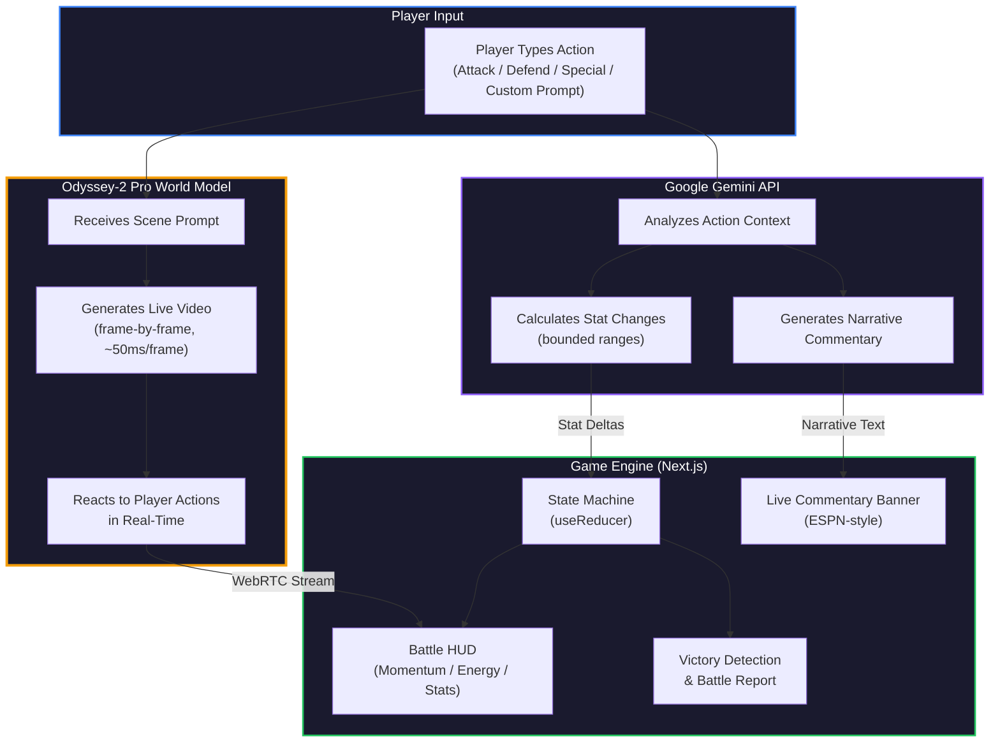

# Odyssey Arena

## Live AI Battle Simulation with Real-Time Commentary

> The first game where AI generates both the battle visuals AND live play-by-play commentary

Two players create characters, place them in AI-generated worlds, and battle in real-time -- with ESPN-style live commentary powered by Google Gemini narrating every move. Every frame is generated live by Odyssey-2 Pro. No pre-rendered assets, no scripted animations -- just pure emergent gameplay.

**GitHub:** [github.com/HiNala/Odyssey-Hackathon](https://github.com/HiNala/Odyssey-Hackathon)

---

## What Makes This Different

**Every other Odyssey project:** "Look at this AI-generated video"

**Odyssey Arena:** "Watch characters battle with live AI commentary that makes you feel like you're watching ESPN"

### The Innovation

- **Dual AI System**: Odyssey generates visuals, Gemini generates commentary
- **Real-Time Commentary**: Every action gets instant announcer-style narration displayed as a prominent banner
- **World Model as Game Engine**: Odyssey-2 Pro isn't just rendering video -- it IS the game engine, reacting to player actions frame-by-frame
- **No Pre-Rendered Assets**: Every pixel and every word of commentary generated live by AI

---

## Architecture



> **Odyssey-2 Pro** is the core -- it's not just rendering video, it IS the game engine. Every frame is predicted live based on physics and narrative context, reacting to player actions in real-time via WebRTC. **Google Gemini** runs in parallel, generating vivid battle commentary and balanced stat changes that feed the game state.

---

## Features

| Category | Features |
|----------|----------|
| **AI Commentary** | Live ESPN-style banners, battle opening/closing narration, hype callouts |
| **AI Video** | Odyssey-2 Pro real-time streams that react to player actions |
| **Battle System** | Momentum, power, defense, energy -- reach 100 momentum to win |
| **Combat Depth** | Combo chains, 5 status effects (burning, frozen, powered, weakened, shielded) |
| **Impact Feedback** | Screen shake, CRITICAL! overlays, damage popups, dynamic commentary |
| **Quick Actions** | Attack, Defend, Special, Taunt with energy costs |
| **Victory** | Flawless Victory / Comeback / Domination classifications + full battle report |
| **Demo Mode** | Full game flow without API keys for instant testing |
| **Polish** | Custom player names, stalemate prevention, auto-demo intro |

---

## Tech Stack

| Layer | Technology |
|-------|-----------|
| Framework | Next.js 16 (App Router) |
| Language | TypeScript 5 |
| Styling | Tailwind CSS v4 |
| Animation | Framer Motion |
| AI Video | Odyssey-2 Pro SDK |
| AI Narrative | Google Gemini API |
| State | React useReducer + Context |
| Icons | Lucide React |

---

## Quick Start

### Prerequisites

- Node.js 18+
- [Odyssey API Key](https://developer.odyssey.ml)
- [Google Gemini API Key](https://aistudio.google.com/apikey)

### Setup

```bash
git clone https://github.com/HiNala/Odyssey-Hackathon.git
cd Odyssey-Hackathon/odyssey-arena
npm install --legacy-peer-deps
```

Create `odyssey-arena/.env.local`:

```env
NEXT_PUBLIC_ODYSSEY_API_KEY=ody_your_key_here
GEMINI_API_KEY=your_gemini_key_here
GEMINI_MODEL=gemini-3-flash-preview
```

### Run

```bash
npm run dev
```

Open [http://localhost:3000](http://localhost:3000). Click **Demo Mode** to play without API keys.

---

## How to Play

1. **Enter Names** -- Personalize player names on the start screen
2. **Create Characters** -- Describe each character and their world (or pick a preset)
3. **Battle** -- Use quick action buttons or type creative custom prompts
4. **Win** -- Drive your momentum to 100 (or your opponent's to 0)

| Action | Effect | Energy Cost |
|--------|--------|-------------|
| Attack | Deal damage, gain momentum | 10 |
| Defend | Boost defense, recover energy | 7 |
| Special | High risk/reward, big momentum swing | 25 |
| Taunt | Drain opponent energy | 5 |

**Pro tip:** Creative, descriptive prompts score higher impact than generic ones.

---

## Architecture

### Game State Machine

```
IDLE --> SETUP --> BATTLE --> VICTORY
  ^                            |
  +-------- RESET ------------+
```

14 action types flow through a single `gameReducer` with discriminated unions for type safety.

### Key Technical Decisions

- **3-Layer Prompt System**: Base world + character injection + action prompts using state descriptions (prevents Odyssey animation looping)
- **Singleton Odyssey Client**: One session per API key with automatic reconnection and exponential backoff
- **Bounded AI Stat Changes**: Gemini follows strict numerical ranges for balanced, predictable gameplay
- **Passive Energy Regeneration**: +3 energy/turn prevents stalemates
- **30-Turn Stalemate Resolution**: Auto-declares winner by momentum if battle runs long

### Project Structure

```
odyssey-arena/
  app/
    page.tsx              # Main arena (all game phases)
    layout.tsx            # Root layout + providers
    globals.css           # Tailwind v4 + design system
    api/gemini/           # Gemini AI route (server-side, key never exposed)
  components/
    AutoDemo.tsx          # Auto-playing intro sequence
    BattleOverlays.tsx    # Live commentary banners + combo counter + hype callouts
    ArenaBackground.tsx   # Atmospheric gradient background
    PhoneFrame.tsx        # Video container with player accent borders
    OdysseyStream.tsx     # Odyssey video stream + status overlays
    CenterHUD.tsx         # Momentum bars, energy bars, stats, event log
    ActionButtons.tsx     # Quick battle actions with glow effects
    PromptInput.tsx       # Custom action input
    SetupForm.tsx         # Character + world creation with presets
    VictoryOverlay.tsx    # Battle report + victory classification
    DamagePopup.tsx       # Floating momentum change numbers
  hooks/
    useGameFlow.ts        # Game orchestration (combines state + SDK)
    useOdysseyStream.ts   # Odyssey SDK connection lifecycle
  lib/
    gameState.ts          # Reducer, selectors, victory conditions
    scoring.ts            # AI-enhanced stat calculation + narrative
    prompt-templates.ts   # 3-layer prompt architecture
    evolution.ts          # Character evolution system
    animations.ts         # Framer Motion variants
    storage.ts            # Battle history persistence (localStorage)
  types/
    game.ts               # All game type definitions
  context/
    GameContext.tsx        # Global state provider
```

---

## 30-Second Demo

1. Auto-intro plays showing key features (click to skip)
2. Enter player names, click "Start Game" or "Demo Mode"
3. Create two characters with descriptions and worlds
4. Battle starts -- commentary: *"Shadow Knight vs Storm Mage -- the battle begins!"*
5. Attack -- banner slides in: *"A devastating strike cleaves through the defender's guard!"*
6. Critical hit -- screen shakes, "CRITICAL!" overlay flashes
7. Victory -- full battle report with stats, MVP highlight, victory classification

---

## Design

Dark-first design system. No emojis, no floating orbs, no gimmicks. Professional craft.

- **Palette**: Zinc-based dark theme with amber (Player 1) and violet (Player 2) accents
- **Typography**: Geist Sans / Geist Mono
- **Animations**: Purposeful -- spring physics for feedback, no decorative motion
- **Scrollbars**: Custom-styled to match the dark theme globally
- **Icons**: Lucide React throughout (no emojis anywhere in the app)

---

## License

MIT

---

Built for the **Odyssey-2 Pro Inaugural Hackathon** -- February 2026, Menlo Park, CA.

Judged by **Soleio** (Facebook's first designer), **Oliver Cameron** (Odyssey CEO), and the Odyssey team.
